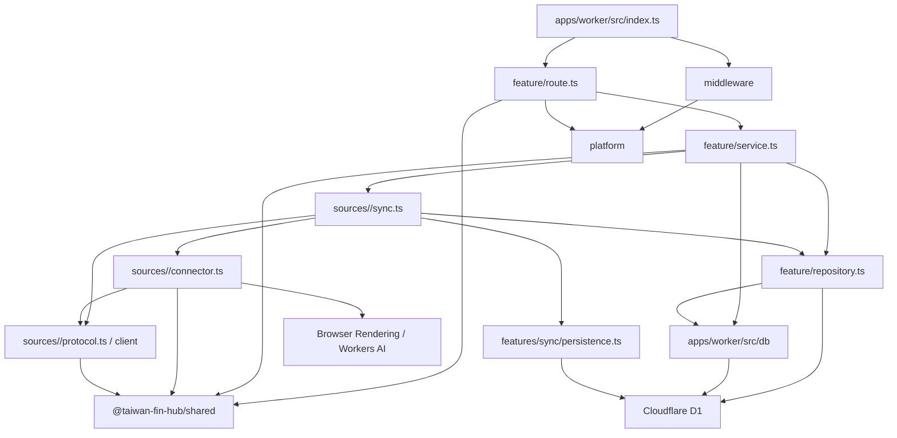
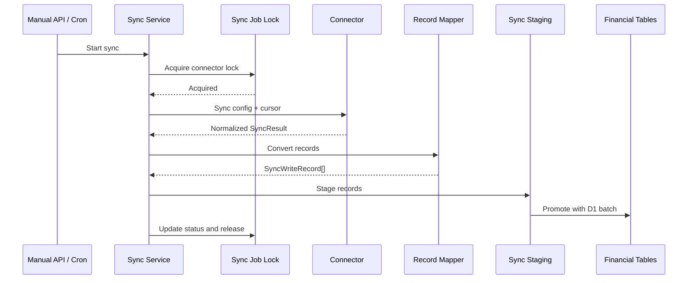

# 後端架構與維護約定

後端執行於 Cloudflare Workers，使用 Hono 提供 API，並透過 Cloudflare D1、Browser Rendering、Workers AI、Cron Triggers 與 Queues 完成資料儲存、銀行登入、驗證碼辨識及排程同步。

目前後端採用 **feature-oriented Vertical Slice Architecture**。程式依業務功能分組，而不是將所有 Controller、Service、Repository 分別集中在全域目錄。

`apps/worker/src/index.ts` 是 Composition Root，只負責：

- 建立 Hono application。
- 註冊全域 middleware。
- 組裝各 feature routes。
- 設定統一錯誤處理。
- 提供前端靜態資源。
- 接收 Cloudflare scheduled event 與 Queue message batch。

入口檔不得放置 SQL、connector 實作或具體商業流程。

## 整體結構

```text
apps/
├── web/
└── worker/
    ├── src/
    │   ├── index.ts
    │   ├── features/
    │   │   ├── activity/
    │   │   ├── bank/
    │   │   ├── classification/
    │   │   ├── connectors/
    │   │   ├── dashboard/
    │   │   ├── exchange-rates/
    │   │   ├── investments/
    │   │   ├── invoices/
    │   │   ├── manual-assets/
    │   │   ├── net-worth/
    │   │   ├── notifications/
    │   │   ├── ocr/
    │   │   └── sync/
    │   │       ├── manual-sync.ts
    │   │       ├── scheduling/
    │   │       └── reports/
    │   ├── sources/
    │   │   ├── types.ts
    │   │   ├── config-registry.ts
    │   │   ├── browser.ts
    │   │   └── <connectorId>/
    │   ├── db/
    │   │   └── schema/
    │   ├── middleware/
    │   └── platform/
    ├── migrations/
    ├── schema-metadata.json
    ├── seeds/
    └── tests/
        ├── sources/
        ├── db/
        ├── features/
        ├── helpers/
        ├── middleware/
        └── platform/

shared/
├── package.json
├── tsconfig.json
├── index.ts
├── financial-types.ts
├── api-types.ts
├── bank-api.ts
├── connector-catalog.ts
└── activity-*.ts
```

npm workspaces 僅保留 Web、Worker 與根目錄的 `shared/`。`shared/` 以 `@taiwan-fin-hub/shared` 提供跨前後端共用的型別、契約與純邏輯。資料庫與連接器是 Worker 內部模組，共用相依宣告與型別檢查；透過目錄維持資料存取、外部協定與平台 adapter 的責任分工。

## 相依方向



基本原則：

- `route.ts` 不直接撰寫 SQL。
- `repository.ts` 不處理 HTTP request、status code 或 Hono `Context`。
- `service.ts` 不回傳 Hono `Response`。
- feature 不得依賴其他 feature 的 `route.ts`。
- 跨 feature 的 service 呼叫應保持明確，避免形成循環相依。
- 不為了符合形式而建立空的 Service 或 Repository。
- 不建立通用 `BaseRepository` 或過度抽象的資料存取層。

## Feature 內部結構

複雜 feature 通常採用以下結構：

```text
features/<feature>/
├── route.ts
├── service.ts
├── repository.ts
└── 其他只屬於此 feature 的檔案
```

不是每個 feature 都必須包含全部三個檔案。簡單查詢可以只有 `route.ts` 與 `service.ts`；沒有資料庫操作時不需要建立 `repository.ts`。

### `route.ts`

HTTP adapter，負責：

- 宣告 API path 與 HTTP method。
- 定義 request schema。
- 使用 Zod 驗證 body、query 與 path parameters。
- 從 Hono `Context` 取得 binding、parameter 與已驗證資料。
- 呼叫 service。
- 將預期的 service error 轉換成 HTTP status 與穩定 error code。
- 組裝 response 與 pagination headers。

不應負責：

- 直接執行 SQL。
- 實作分類、計算或同步流程。
- 處理 connector protocol。
- 執行大型資料轉換。

### `service.ts`

Use case 與商業流程層，負責：

- 組合一個完整 use case。
- 執行商業驗證與計算。
- 協調 repository、connector 與其他 service。
- 控制資料同步流程。
- 定義可預期且可由 route mapping 的 error class。
- 將 repository row 轉換成 API 所需資料。
- 管理時間、ID、加密、cursor 與同步狀態。

Service 可以直接接受 `D1Database` 或 `Env`，不需要額外建立 Dependency Injection container。

若程式只是單純資料查詢，應維持簡單，不需要套用 DDD Aggregate、Value Object 或 Command Bus。

### `repository.ts`

Feature 專用的 D1 存取層，負責：

- 集中該 feature 使用的資料存取。
- 一般 CRUD 與查詢組合預設使用 `apps/worker/src/db` 的 Drizzle schema／client。
- 執行 query、insert、update、delete 與 upsert。
- 回傳 database row、affected row count 或存在性結果。
- 在仍需原生 statement 時，建立供 service 組合的 `D1PreparedStatement`。

過渡期 repository／service 仍接受 `D1Database`，在 repository 內呼叫 `createDrizzle(binding)`，不另建 DI container，也不建立跨 request／Queue invocation 的全域 client。TypeScript property 使用 camelCase，並明確對應既有 snake_case 欄位；回傳給 service／API 的 shape 由 selection 或 mapper 維持，不把 `$inferSelect` 當成 runtime validation。

複雜 expression、CTE、條件 upsert、跨檔案組成的原生 D1 batch，或轉換後無法保留語意的路徑，可繼續使用參數化 raw SQL，並在呼叫處註明原因。同一 batch 不得混用不相容的 Drizzle query object 與 `D1PreparedStatement`。

Repository 不應：

- 接收 Hono `Context`。
- 回傳 HTTP response。
- 決定 HTTP status code。
- 呼叫外部銀行或政府 API。
- 包含與資料存取無關的商業流程。

SQL 應放在使用它的 feature 附近。只有確實被多個 feature 共用的資料存取能力，才放入 `apps/worker/src/db`。

## 共用目錄責任

### `apps/worker/src/platform/`

Cloudflare Worker 與 HTTP 平台層，目前包含：

- Worker bindings 與 Hono binding types。
- Hono factory。
- API error response。
- Demo 唯讀模式。
- Cursor pagination 工具。
- Zod validation hook。
- Cloudflare Access JWT 驗證。
- 設定與加密工具。

`platform` 不得依賴任何具體 feature。

### `apps/worker/src/middleware/`

跨 route 的 HTTP middleware：

- `accessMiddleware`：驗證 Cloudflare Access 身分；Demo 模式略過登入。
- `demoReadOnlyMiddleware`：Demo 模式只允許安全的唯讀 method。
- `connectorContextMiddleware`：驗證 connector ID，並寫入 Hono variables。

Middleware 應只處理跨功能的 request concern，不應承擔 feature 商業邏輯。

### `apps/worker/src/sources/`

各銀行、集保與電子發票以資料來源為目錄歸屬。維護一家銀行時，在 `sources/<connectorId>/` 查找它的同步、登入、API client、解析與資料修復；依實際需要保留檔案，不要求每個來源有同一套檔案。

- `sync.ts`：讀取及解密設定、處理 challenge、呼叫 connector，組合共用 persistence 與來源 repository。
- `connector.ts`：需要 Browser Rendering、Puppeteer 或 Worker binding 的外部取資料 adapter；可以使用 `BROWSER` 或 `AI`，不直接讀寫 D1。
- `protocol.ts` 與 API client：設定 schema、外部協定、signing／encryption、parser、response normalization，以及不需要 Worker binding 的 connector。
- `repository.ts`、`authorizations.ts` 等：來源專用的資料修復、交易配對與存款生命週期。
- `run-repository.ts`：電子發票與集保的 durable run／item、進度、session 與處理 lease。

實體目錄集中不改變相依邊界：`sync.ts` 可依賴 connector、protocol、client、repository 與明確的共用 service；protocol／client 不得依賴 Hono、D1、Worker `Env`、adapter 或同步流程，也不得直接寫入資料庫。來源之間不引用彼此的內部實作。

`sources` 根目錄只保留跨來源使用的能力：`browser.ts` 管 browser acquisition 與 capacity 錯誤，`types.ts` 定義後端 `Connector`／`SyncResult`，`sync-window.ts` 與 `credit-card-status.ts` 提供共同 policy／判斷。`config-registry.ts` 直接引用各來源的純 schema，供設定 feature 使用；同步 handler 仍由 `features/sync/registry.ts` 組裝。Worker 與測試直接引用來源檔案，不建立跨來源的實作匯出入口。

### `shared/`

前端、Worker 與 connector 共用的穩定契約及純邏輯，包括：

- 金融資料型別。
- `ConnectorId` 與支援清單。
- API success/error contract。
- 銀行與信用卡帳單 API response contract。
- 活動配對、去重、排序與資料組裝。

不得將 Hono `Context`、D1 row 或 Puppeteer object 放入共用契約。

`index.ts` 只提供匯出；金融正規化資料、API 型別與 connector catalog 分別維護於 `financial-types.ts`、`api-types.ts`／`bank-api.ts` 與 `connector-catalog.ts`。銀行 route 以 `satisfies` 在 JSON 回傳處檢查共用 response 契約；此契約描述現有 JSON 的 nullable 欄位與帳單數值 flag，與 connector 的正規化資料及 repository row 各自獨立。

### `apps/worker/src/db/`

真正跨 feature 使用的 D1 基礎能力，目前主要包括：

- `createDrizzle(binding)`：以當次 request／Queue 的 D1 binding 包成 Drizzle client，關閉 query／parameter logging。不是連線池或 DbContext。
- `schema/`：依業務領域描述現有業務表；SQL migrations 仍是 schema 權威。
- Connector settings（Drizzle CRUD，保留既有 ID、建立時間與 sync cursor）。
- `sanitizeDatabaseError(error)`：在設定存取、API 與通知 log 邊界移除 Drizzle query error 的 SQL、綁定參數及 cause。
- 加密設定與 sync cursor 狀態。
- Sync job、schedule 與 lock。

Drizzle 型別只留在 DB 與 Worker repository 層。`shared`、前端及來源的 protocol／client／connector 不依賴 ORM。日期維持既有 TEXT string，金額與 JSON／flag 語意不因導入而改寫。

Feature-specific 查詢應放在 feature 的 `repository.ts`，而不是持續擴大 `apps/worker/src/db/index.ts`。一般 repository 以 Drizzle 為預設寫法；sync job、run／item、排程、通知批次及報告的一般讀取，以及同步 lease 與獨立 run 狀態更新已使用 Drizzle。selection 維持既有 row shape、排序與 LEFT JOIN null；staging promotion 與 durable item 寫入的 statement composition 保留整組原生 D1 batch。

分類 repository 已轉換為 Drizzle；規則重排維持單一 batch，保留 NOCASE 分類唯一性、系統規則保護與 override conflict target。invoices、investments 與 bank 的一般列表／明細查詢已轉換為 Drizzle，保留游標分頁、LEFT JOIN null、pending／posted 可見性與 TEXT 日期邊界；銀行交易日條件維持可使用 `idx_bank_transactions_transaction_day`。dashboard、net-worth、activity 與 bank calculation／search 聚合已轉換為 Drizzle，保留計算值、跨來源去重、TEXT 日期與 activity search CTE；同步 lease／run 狀態更新以 Drizzle 保留單次條件 UPDATE 與 affected rows 判斷；staging promotion 保留原生 batch 的順序、計數 offset、finalize／cursor／cleanup 原子邊界。保留 SQL 的範圍與測試見下方維護約定。

資料庫 schema 與預設資料必須透過：

```text
apps/worker/migrations/
```

管理，不得由 `GET` API 在執行期間自動建立，也不得對正式環境使用 `drizzle-kit push`。隔離 D1 整合測試以 Miniflare／workerd binding 按順序重播 migrations，不連線正式資料庫。

Schema 文件語意維護於 `apps/worker/schema-metadata.json`，以 `npm run db:schema:docs` 重新產生 `docs/database-schema.md`；Demo 種子資料位於 `apps/worker/seeds/demo.sql`。資料庫測試位於 `apps/worker/tests/db/`，由 `npm run test:backend` 一併執行。

### Drizzle 與原生 SQL 維護約定

一般 CRUD、篩選與 JOIN 優先使用 Drizzle；不為統一語法重寫已有測試的穩定 SQL。
複雜 CTE、window function、set-based upsert 或跨檔案組合的 D1 batch，
以可讀性與保留原子性為準，保留原生 SQL 並註明理由。

| 保留範圍                                            | 原因與驗證重點                                                                                                                                                              |
| --------------------------------------------------- | --------------------------------------------------------------------------------------------------------------------------------------------------------------------------- |
| staging JSON upsert、promotion 與 lifecycle 合併    | cursor／finalize／cleanup 必須在同一 batch。`persistence.test.ts`、`preference-fk-reconciliation.test.ts`、`drizzle-runtime.test.ts` 以隔離 D1 驗證去重、使用者決定與回滾。 |
| einvoice／TDCC durable item 寫入與 create-or-get    | 保留 item claim、JSON merge、計數、設定版本 CAS 及 partial unique conflict 處理。以共用 lease 與發票 promotion 核心案例驗證並行與重送。                                     |
| schedule／notification batch／report 寫入及財務 CTE | 保留固定成員快照、notification claim、報告修復及跨資產最新值／缺幣計算；不因統一語法改變這些行為。                                                                          |

Lease acquisition／renewal 維持單次條件 UPDATE 與 affected rows 判斷，
不得拆成 SELECT 後 UPDATE；不得用循序 await 或 Promise.all 取代原子 batch。
查詢調整須保留 expression index 的可用性；涉及查詢效能時以 EXPLAIN QUERY PLAN 確認。

SQL migrations 是 schema 權威，由 Wrangler 管理套用與 migration ledger；
不導入 Drizzle Kit 生成／套用 migration 流程，也不另維護 schema 比對測試。
Schema 修改時依實際影響驗證 migration 與 FK、CHECK、generated column、unique 等約束。

Drizzle repository 整合測試使用 `apps/worker/tests/helpers/d1.ts` 的 Miniflare／workerd D1，
聚焦資料完整性、安全與 batch 回滾，不為一般 CRUD、row shape 或排序逐項建檔。
直接 import Drizzle 的 workspace 應自行宣告相依，不依賴 npm hoisting。

### 交易與發票偏好的參照完整性

`bank_transaction_preferences.transaction_id` 與
`invoice_transaction_preferences` 的 `invoice_id`／`transaction_id` 使用 FK，
刪除策略為 `NO ACTION`。合併資料須在同一 batch 先移轉或明確處理偏好，再刪除舊資料；
不得以 CASCADE 或自動清空交易 ID 抹除 linked／separate 決策。
玉山 lifecycle shadow、永豐及華南 legacy 比對共用 `transaction-merge.ts`：
僅合併雙向唯一對應且發票配對、計算偏好、分類覆寫不衝突的交易。
在同一 promotion batch 移轉偏好與交易引用後才刪除舊交易，保留決策及時間；
兩端相同的計算／分類偏好保留新版既有資料。無對應、配對歧義或偏好衝突時，
保留原交易及設定；華南亦不再直接清除沒有對應的 legacy 資料。

0045 套用前須唯讀查核以下三種孤兒引用（包含 separate 的非 NULL transaction_id）：

```sql
SELECT 'bank_transaction_preferences.transaction_id' AS reference, COUNT(*) AS orphan_count
FROM bank_transaction_preferences p
WHERE NOT EXISTS (SELECT 1 FROM bank_transactions t WHERE t.id = p.transaction_id)
UNION ALL
SELECT 'invoice_transaction_preferences.invoice_id', COUNT(*)
FROM invoice_transaction_preferences p
WHERE NOT EXISTS (SELECT 1 FROM invoices i WHERE i.id = p.invoice_id)
UNION ALL
SELECT 'invoice_transaction_preferences.transaction_id', COUNT(*)
FROM invoice_transaction_preferences p
WHERE p.transaction_id IS NOT NULL
  AND NOT EXISTS (SELECT 1 FROM bank_transactions t WHERE t.id = p.transaction_id);
```

有孤兒引用時先檢視來源與使用者決策，不自動刪除或補造父資料。
0045 以完整複製保留偏好及時間；有違規時 migration transaction 失敗回滾。
遠端套用前另確認 0044 的 NULL PK 前置條件、備份及隔離升級驗證。

### 交易自關聯

0046 為 `bank_transactions.transfer_peer_id` 與 `matched_transaction_id` 新增
指向同表 `id` 的 `NO ACTION` FK，並新增 transfer peer 索引；matched transaction
原有 partial unique index 保留。允許 NULL 與自我引用，不使用 CASCADE／SET NULL，
避免刪除父交易時改變 pending 可見性或定存計算排除。

Migration 在同一 transaction 暫存並重建兩張引用交易的 preferences 表，
保留所有交易、偏好、時間、generated column 及原有索引。孤兒引用會使升級回滾，
不自動補造父交易或清空配對。套用前備份並唯讀查核：

```sql
SELECT 'transfer_peer_id' AS reference, COUNT(*) AS orphan_count
FROM bank_transactions t
WHERE t.transfer_peer_id IS NOT NULL
  AND NOT EXISTS (SELECT 1 FROM bank_transactions p WHERE p.id = t.transfer_peer_id)
UNION ALL
SELECT 'matched_transaction_id', COUNT(*)
FROM bank_transactions t
WHERE t.matched_transaction_id IS NOT NULL
  AND NOT EXISTS (SELECT 1 FROM bank_transactions p WHERE p.id = t.matched_transaction_id);
```

一般 transaction promotion 以同一 statement 寫入交易及 transfer peer；永豐在
promotion 後更新授權配對，中信刪除副本前處理 matched reference，共用合併流程先移轉
兩種引用。未來若將相依交易拆成不同 statements，須先寫入被引用交易，
或在同一 batch 明確延後 FK 檢查並驗證回滾；同一 batch 本身不保證可任意排列。

## HTTP Request 流程

所有 API 掛載在 `/api`：

```text
Request
  → Cloudflare Access middleware
  → Demo read-only middleware
  → Connector context middleware（適用時）
  → Feature route
  → Feature service
  → Repository / Connector
  → JSON response
```

非 `/api` 路徑交由 `ASSETS` binding 提供前端靜態檔案。

## Request 驗證

外部輸入應優先使用 Zod 驗證：

```ts
api.post(
  "/example",
  zValidator(
    "json",
    requestSchema,
    validationHook("INVALID_REQUEST", "Request data is invalid."),
  ),
  async (c) => {
    const input = c.req.valid("json");
    return c.json(await executeUseCase(c.env.DB, input));
  },
);
```

約定：

- JSON body 使用 `zValidator("json", ...)`。
- Query string 使用 `zValidator("query", ...)`，或共用 pagination parser。
- 有固定集合或格式限制的 path parameter 使用 `zValidator("param", ...)`。
- 不得將未驗證的 request body 直接傳入 service 或 SQL。
- Client 不應依賴 Zod 的原始錯誤文字；API 應回傳穩定 error code。

## API 錯誤格式

API error 統一為：

```json
{
  "success": false,
  "error": {
    "code": "ERROR_CODE",
    "message": "Human-readable message."
  }
}
```

錯誤處理分為兩類：

### 預期錯誤

例如：

- Resource not found。
- Duplicate resource。
- Connector 尚未設定。
- OTP 或 CAPTCHA 需要人工處理。
- 同一 connector 已有同步工作執行中。
- 外部 connector 暫時無法使用。

Service 應使用明確的 error class 表示，route 再映射成固定 HTTP status 與 error code。

### 未預期錯誤

未被 route 處理的錯誤交由全域 `api.onError`：

- 在 Worker log 記錄完整錯誤。
- Client 固定收到 `INTERNAL_ERROR`。
- 不得回傳原始 exception、stack trace、SQL 或敏感 connector response。
- 帳號、Cookie、token、OTP 與解密後 config 不得寫入 log。

只有已知且確認不包含敏感資料的 connector 錯誤，才可將經整理的 message 回傳給 client。

## Pagination

大型且持續新增的資料列表使用 cursor-based keyset pagination：

```http
GET /api/activity?limit=50&cursor=<opaque-cursor>
```

規則：

- `limit` 預設通常為 50。
- `limit` 最大值為 100。
- `cursor` 是不透明值，前端不得解析或自行產生。
- 查詢必須使用穩定且唯一的排序欄位組合。
- 不再為新 API 增加 `offset` pagination。

回應維持既有 JSON 資料格式，並使用 headers：

```http
X-Has-More: true
X-Next-Cursor: <opaque-cursor>
```

只有 `X-Has-More` 為 `true` 時，才需要回傳 `X-Next-Cursor`。

## Connector 同步架構

共用同步管理位於 `features/sync`，各來源實作位於 Worker 根層的 `sources`：

```text
apps/worker/src/features/sync/
apps/worker/src/sources/
```

目錄依同步管理與資料來源分組：

```text
sync/
├── route.ts                   # 手動同步與 challenge API
├── manual-sync.ts             # 手動同步的鎖、結果狀態與報告修復
├── registry.ts                # 來源 dispatch 與 scope 驗證
├── types.ts
├── config.ts
├── connector-state.ts
├── connector-repository.ts
├── lock.ts
├── errors.ts
├── record-mapper.ts
├── persistence.ts
├── transaction-merge.ts
├── card-reconciliation.ts
├── scheduling/
│   ├── route.ts               # 排程設定與工作狀態 API
│   ├── service.ts             # 排程設定 use case
│   ├── repository.ts          # 排程設定與 sync jobs 存取
│   ├── scheduler.ts           # 到期工作選取與執行
│   ├── queue.ts               # Queue producer／consumer 與重試
│   └── batch-repository.ts    # 預設排程一輪的固定成員與結案
└── reports/
    ├── route.ts               # 最近報告與活動明細 API
    ├── repository.ts          # 金融快照、報告查詢與修復
    ├── activity-capture.ts    # 寫入前後的活動變化 journal
    ├── activity-detail-service.ts
    └── activity-detail-repository.ts

sources/
├── browser.ts
├── types.ts
├── config-registry.ts
├── sync-window.ts
├── credit-card-status.ts
├── esun/
│   ├── sync.ts                # 玉山同步 use case
│   ├── connector.ts           # 銀行登入、session 與資料擷取
│   ├── protocol.ts            # 純設定 schema
│   ├── portal.ts              # 銀行頁面擷取與解析
│   ├── authorizations.ts      # 待入帳／已入帳銜接
│   └── repository.ts          # 玉山專用舊資料修復
├── sinopac/
│   ├── sync.ts
│   ├── connector.ts
│   ├── protocol.ts
│   ├── deposit-protocol.ts
│   ├── authorizations.ts
│   ├── matching.ts
│   └── repository.ts
├── einvoice/
│   ├── sync.ts                # 電子發票 Queue 分段同步
│   ├── protocol.ts
│   ├── api.ts
│   ├── v2-client.ts
│   ├── invoice-data.ts
│   └── run-repository.ts      # durable run／item 與處理 lease
├── tdcc/
│   ├── sync.ts                # 集保 Queue 分段同步
│   ├── protocol.ts
│   ├── epassbook-client.ts
│   └── run-repository.ts
└── <其他銀行>/
    ├── sync.ts
    ├── protocol.ts
    └── 來源專用 connector／client／輔助檔案
```

根目錄共用檔案的責任如下：

| 檔案                                             | 責任                                                                                                                                       |
| ------------------------------------------------ | ------------------------------------------------------------------------------------------------------------------------------------------ |
| `route.ts`                                       | 手動同步 API、request validation 與 connector-specific 錯誤 mapping。                                                                      |
| `manual-sync.ts`                                 | 一般銀行手動同步的 lock、狀態更新與已結案排程報告修復協調。                                                                                |
| `registry.ts`                                    | 從共用 catalog 驗證 scope，dispatch 單次同步與 challenge handler；電子發票與集保的 `run` 明確拒絕單次同步，入口必須使用各自的 Queue 流程。 |
| `types.ts`                                       | 同步 scope、scope 常數與 outcome 型別。                                                                                                    |
| `config.ts`、`connector-state.ts`                | 取得設定、加密敏感欄位，區分公開偏好、敏感 session 與安全 cursor。                                                                         |
| `connector-repository.ts`                        | 共用設定／cursor 寫入、設定版本 guard 與跨來源帳戶關聯；銀行專用修復放在來源目錄。                                                         |
| `lock.ts`、`errors.ts`                           | 共用 lease／heartbeat、使用者操作判定與錯誤訊息／log 脫敏。                                                                                |
| `execution.ts`、`run-state.ts`                   | 每次同步的期限、失鎖取消、D1 owner guard，以及 durable run 的停滯／重試狀態。                                                              |
| `record-mapper.ts`、`persistence.ts`             | 將 connector result 轉成 write record，透過 staging table 與 D1 batch 寫入正式資料表。                                                     |
| `transaction-merge.ts`、`card-reconciliation.ts` | 共用舊交易合併與單卡摘要帳戶修復；保留使用者偏好、分類與發票關聯。                                                                         |

Worker 的 `sources/<connectorId>/sync.ts` 負責設定解密、connector 呼叫與同步資料寫入；單次銀行流程也處理互動式 challenge，override 型別與來源 colocate。`ctbc/authorizations.ts` 管信用卡授權合併，`hncb/repository.ts` 管華南舊交易／帳戶修復，`nextbank/deposits.ts` 與 `obank/time-deposits.ts` 管存款生命週期。共用同步管理留在 `features/sync`，來源之間共用的外部取資料工具留在 `sources` 根目錄。

各來源直接引用同一來源目錄的 protocol／adapter，以及 `features/sync` 的共用 record mapper、persistence，不經由 `manual-sync.ts` 匯出，也不互相依賴其他來源。電子發票與集保的 `sync.ts`／`run-repository.ts` 管理 durable Queue 流程，集保不再保留另一套單次同步實作。目錄調整不改變驗證、session、cursor 與 D1 promotion／finalize 的原子邊界。

閱讀一般銀行手動流程時，依序看 `features/sync/route.ts` → `manual-sync.ts` → `registry.ts` → `sources/<connectorId>/sync.ts`，再查看同一來源的 connector／protocol 與共用 `features/sync/persistence.ts`。排程流程從 `features/sync/scheduling/queue.ts` → `scheduler.ts` 開始；電子發票與集保則直接看來源的 `sync.ts` 和 `run-repository.ts`。來源專用測試與 fixtures 位於 `apps/worker/tests/sources/<connectorId>`；跨來源的同步資料完整性測試留在 `tests/features/sync`。

同步資料流：



## 同步鎖與排程

同一個 connector 的不同同步 scope 共用 canonical connector lock，避免以下工作重疊：

- 手動同步與排程同步。
- 全部同步與部分同步。
- CAPTCHA preparation 與正式同步。

目前同步 lock：

- 一般同步與 durable run 的 connector lease 為 10 分鐘；CAPTCHA preparation 維持 3 分鐘。
- 執行期間每 5 分鐘續租。
- 一般同步自執行開始最多 10 分鐘；電子發票與集保自 run 建立起最多 10 分鐘，包含 Queue 等待與所有分段，heartbeat 不延長整體期限。CAPTCHA preparation 最多 3 分鐘，來源既有的較短期限仍適用。
- 續租只允許未過期的 owner。續租失敗或達到期限會透過 AbortSignal 停止等待，關閉仍連線的 Browser session，並中止電子發票／集保 HTTP 請求；未支援取消的外部請求即使遲到完成，也不能寫入 D1。
- `execution.ts` 為本次 invocation 包裝 D1 binding，所有 prepared write 與 batch 都在同一 transaction 前置 canonical owner／有效期限 guard；durable chunk 另核對 chunk owner。正式金融資料、設定／cursor、同步結果與報告皆使用受保護的 binding。失鎖時整個 batch 回滾，不能只在寫入前單獨查鎖。
- 一般同步工作完成或失敗後必須在 `finally` 釋放。durable run 的 connector lock 跨 invocation 維持，由成功寫入或失敗結案流程釋放；每段另有 owner-scoped run lease。
- Lock acquisition 失敗時回傳或記錄「已有同步執行中」，不得平行執行同一 connector。

每次 10 分鐘 Cron kick 先恢復停滯的電子發票／集保 run：沒有有效 chunk lease 且 3 分鐘未更新者補送 continuation，超過整體期限者先以 owner guard 結案。有效 chunk lease 不會被 Cron 中止；該 invocation 自行受執行期限限制。一般同步的過期殘留鎖會標記失敗並清除，保留最後成功時間。單一 run 的恢復失敗只記錄 log，不阻擋其他 run 與 scheduler kick；20 秒的 scheduler 串接不重複執行恢復。

Cron trigger 向 `SYNC_QUEUE` 送出 scheduler 啟動訊息。Queue consumer
每次 invocation 最多處理一個 connector，完成後若確實處理了工作便以 20 秒延遲送出下一個訊息，
避免連續啟動 Browser session 時撞上 Browser Run 的 acquisition rate limit；下一次 consumer
invocation 因此不必等待下一個 10 分鐘 Cron，且擁有獨立的 Worker CPU、subrequest 與執行時間額度。
初始 Cron kick 不延遲。Queue consumer 使用 batch size 1 與 concurrency 1，維持 connector
逐一執行。是否到期仍由 D1 sync job 狀態判斷；沒有可執行工作時 consumer 不再送出訊息，
結束本次串接。

Demo 模式（`DEMO_MODE`）不執行背景同步：Cron 不送出 scheduler 啟動訊息，Queue consumer
不處理任何訊息，避免啟用 Demo 前殘留的訊息繼續以已儲存的憑證登入外部服務。scheduler 啟動訊息
直接 ack；電子發票與集保分段訊息則以 1 小時延遲重新送出以保留 continuation，關閉 Demo 後會
重新檢查進行中的 durable run；已超過整體期限者結案，需要重新啟動同步。若期間 session 過期或設定變更，仍可能需要重新驗證。

電子發票不在單一 connector invocation 內擷取所有品項明細。它使用
`einvoice_sync_runs` / `einvoice_sync_run_items` 作為 durable work queue：手動或排程
建立 run 後 enqueue `run-einvoice-chunk`，每個 Queue invocation 最多 claim 並取得 35
張發票明細，並以 set-based D1 寫入完成整批；仍有 pending work 時再 enqueue continuation。品項明細一律同步，並非
`public_config`、HTTP request 或 catalog 可選的 `fetchDetails` 偏好。

電子發票 run 與 item 都以 owner-scoped rolling lease 防止 Queue delivery 重送時平行處理。
每次 delivery 使用獨立 UUID 作為 chunk owner；3 分鐘 chunk lease 每分鐘續租，明細處理也每五張續租，續租不更新業務進度時間。
只有全部 item 成功後，service 才把 durable run items 當作 staging source，以固定五個
set-based D1 statements promotion 至正式表並更新 cursor；這個 batch 以設定版本 CAS 防止
憑證更新競態。後續 finalize path 更新 `sync_jobs`、排程批次結果與通知；`promoted_at` 讓
promotion 前後的重送皆可冪等。
暫時錯誤由 Queue retry，session 失效會清除 session 後重新初始化；需要使用者操作或重試
耗盡才將 run 結案為 `needs_user_action` 或 `failed`，不寫入部分完成的明細。
建立 run 後的初始狀態寫入或首次 Queue enqueue 失敗會補償結案並清鎖；重試既有 run 會重新 enqueue，不會只回傳 202 而沒有 continuation。手動重試可補送既有排程 run，保留原 trigger 與批次。逾時且無有效 chunk lease 的舊 run 先結案，再建立新 run。成功／失敗 finalize 同時核對 canonical owner 與 chunk owner／無有效 chunk lease，並在同一 batch 更新結果與釋放鎖。

### 集保分段同步

集保的手動 API 與排程由 `startTdccSyncRun` 建立／取得 active run，再 enqueue
`run-tdcc-chunk`。`tdcc_sync_runs` 保存 scope、設定版本、加密認證與 session；
`tdcc_sync_run_items` 保存銀行與投資交易的分頁工作及結果。同一 connector 的
`all`、`investments`、`bank`、`trades` 共用 active run 限制與 canonical lock。

手動啟動會先初始化登入以回報 OTP 等互動需求；排程由 Queue 初始化且不主動寄送
OTP。API 的排入同步回應不代表全部資料已完成，前端須追蹤 sync job lifecycle。
手動初始化也取得獨立 run lease，避免同一 run 的 Queue delivery 同時登入。
每個 chunk 取得 owner-scoped run lease、更新 connector lock，最多 claim 一個
分頁 item；仍有 pending 或 processing work 時 enqueue 下一段。item 更新使用
claim token，chunk 的 `finally` 只釋放該 owner 的 run lease。
3 分鐘 run lease 每分鐘續租；既有 run 重試會補送 continuation，逾時 run 與停滯恢復沿用電子發票的判斷。

分頁結果完成後彙整並透過 `sync_write_staging` 與 staged persistence 寫入正式表，
寫入前檢查設定版本，並在 promotion batch 更新 connector 狀態、cursor 與 sync job。
後續處理排程結果、手動報告修復與 run 結案；`promoting`、`promoted_at` 用於辨識
promotion 與 finalize 的進度。暫時錯誤使用 Queue retry，需要互動或重試耗盡時結案。
connector lock 保留到報告結果寫入及 run 成功結案；失敗的 run transition、sync job、排程結果、staging 清理與清鎖使用同一個 owner／idle lease guard batch。

`GET /api/sync-jobs` 統一以有效 connector lock 或電子發票／集保 active run 判斷 `running`，並提供 `runId`、`phase`、`lastProgressAt`、`retryAfterSeconds`。durable run 的 `phase = stalled` 表示可補送；有效 chunk lease 的剩餘時間是最短重試等待，不是預估完成時間。一般同步的 `lastProgressAt` 沿用 job 狀態更新時間，可能來自 heartbeat；durable run 則不將 lease renewal 當成進度。

## 同步結果通知

同步結果通知位於 `apps/worker/src/features/notifications/`，不放入 sync repository。

- `route.ts`：推播設定、裝置 subscription、偏好與測試通知 API。
- `service.ts`：VAPID 設定、subscription 加密、通知派送與失效 endpoint 清理。
- `repository.ts`：`push_subscriptions` 與 `notification_preferences` 的 D1 存取。
- `payload.ts`：將 sync status 轉成不含金融明細的安全通知內容。

排程同步更新 `sync_jobs` 後才呼叫通知 service。通知是 best-effort；發送失敗只記錄 log，不得將成功同步改成失敗。瀏覽器 subscription payload 使用既有設定加密金鑰保存。

使用預設排程（`schedule_mode = inherit`）的工作採「一輪一批次」。沒有進行中的批次且至少一個繼承工作到期時，scheduler 會以單一 D1 batch transaction 建立 header，並固定快照當下所有啟用且不需使用者處理的繼承工作。批次進行期間，每次 Queue consumer invocation 只從尚未完成的固定成員中挑選一個目前未鎖定且不需使用者處理的工作；已完成的成員不會在同一輪再次執行，新啟用的工作則等下一輪。排程結果會在釋放 connector lock 前直接寫入成員，避免重複 Queue 訊息遺漏結果；停用、改為自訂排程或進入 `needs_user_action` 的非執行中成員會被略過。只有所有固定成員都有結果或被略過時，scheduler 才以條件式更新取得一次推播發送權並關閉批次，下一輪才能建立。建立新輪次時會清理超過 30 天的已結案批次。手動同步不完成或改寫進行中的批次成員；自訂排程維持逐工作推播。

手動完整同步成功後，可修復最近一筆已結案預設排程報告中同一 connector 的
`failed` 或 `needs_user_action` 來源。修復保留原排程完成時間，另記錄
`recovered_at`，並一次性累加新增筆數、更新報告的 after-snapshot。同步式手動流程
會在開始前固定可修復的批次，避免誤改執行期間才結案的新輪次；集保部分 scope
同步不修復 `all` 的批次結果。

每次 Queue scheduler invocation：

- 最多處理 1 個到期工作，讓每個 connector 使用獨立的 Worker invocation 與 subrequest 額度。
- 每個工作使用獨立 run ID。
- 成功後更新下次執行時間。
- 需要 OTP、CAPTCHA 或重新登入時記錄為 `needs_user_action`。
- 其他錯誤記錄為 `failed`。
- Log 使用結構化 JSON，包含 connector、scope、trigger、status 與 duration。

## 同步資料寫入

Connector 不得直接寫入金融資料表。

銀行確認沒有信用卡時，connector 仍以正常 `SyncResult` 完成同步：支援存款者回傳存款，信用卡專用來源可回傳空結果。空結果仍執行設定／cursor 的 finalize statements，排程記為成功；不刪除既有信用卡歷史，也不建立新的零餘額快照。無卡判斷留在 connector，不能在共用 service 將未知信用卡錯誤改成成功。各行判斷依據見 [Connector 開發規範](004-connector-development.md#無信用卡情境)。

同步 service 應先：

1. 將 connector response 正規化成共用契約。
2. 使用 `record-mapper.ts` 產生 `SyncWriteRecord`。
3. 將 records 分批寫入 `sync_write_staging`。
4. 使用單一 D1 batch 將 staging records promote 至正式資料表。
5. 在同一批次執行必要的 lifecycle reconciliation、cursor 更新與 staging cleanup。

這樣可避免部分資料已更新、cursor 卻未更新，或 cursor 已更新但資料尚未完整寫入。

永豐信用卡取得 `LatestTx.Items` 與 `OutstandingDetail.Detail` 後，在 `bank_transactions`
原表保存授權，以 `matched_transaction_id` 記錄已入帳關係，不另設授權表或停用欄位。
配對僅限同卡、同消費日，不跨日；排除手續費、服務費、不同金額方向與卡片識別不足的資料。
既有相同 sourceId 優先，其次同幣別同金額，再以正規化店名相似度及目前匯率金額接近度
計分；同組採最大總分的一對一分配，無合理候選則不配對。跨幣別不要求人工確認。
已配對關係不重新分配；已入帳保留正式金額、幣別、入帳日與原始 payload，繼承授權時刻。
配對後優先沿用待入帳名稱作為 description 與 counterparty，供顯示、搜尋及規則分類；
空白或預設「永豐信用卡消費」名稱不覆蓋正式名稱。每次同步也修復既有配對，即使銀行
不再回傳該交易；同 ID 入帳沿用已保存名稱。舊版已覆蓋且來源不再提供的名稱無法復原。
在同一 D1 batch upsert 交易、保存配對、補入時刻，並於首次配對移轉原授權的個別分類、
計算偏好（已入帳既有設定優先）及發票關係。原授權與設定持續保存。
活動、搜尋、發票配對候選與收支統計僅排除 `status = 'pending'` 且
`matched_transaction_id IS NOT NULL` 的授權；同 ID 升為已入帳仍正常顯示。
不處理來源消失：未配對授權即使來源不再回傳，仍保留並顯示；空清單不刪除或隱藏資料。
缺少清單或解析失敗不寫入；無有效卡與舊版解析不執行授權配對。
已在舊版永久刪除的授權，若來源不再回傳，無法從此變更復原。

新增同步 entity 時，必須同時更新：

- `SyncEntityType`。
- Entity promotion order。
- Table、columns 與 conflict columns。
- Record mapper。
- D1 migration。
- 涉及四類核心風險時擴充既有測試。

## 排程同步活動明細

總覽的「最近一次排程同步」沿用預設排程報告。展開各資料來源後才載入本次新增活動、
已入帳與補上發票的明細；一般手動同步及自訂排程沒有獨立報告。

- `sync_activity_runs` 在取得同步鎖後登記 run ID 與固定批次。手動完整同步在開始時
  固定可補救報告；只有補救 CAS 成功才發佈明細，不會混入後來完成的新批次。
- `activity-capture.ts` 與 staging promotion 共用原生 D1 batch，在寫入前辨識新增紀錄
  及既有未配對授權，於 lifecycle reconciliation 後保存已入帳關係與標準化快照。
  不以 `updated_at` 判斷內容變化；沒有變化的授權候選在同一 transaction 移除。
- 電子發票 durable promotion 使用相同 settings-version guard 保存新發票快照；
  集保使用既有 promotion 與鎖的 run ID。結果發佈與來源結果更新共用 CAS transaction。
- `reports/activity-detail-service.ts` 在報告結案及手動補救後，以完整同日候選與既有活動配對
  規則建立展示快照。交易與發票在來源明細中合併，同批新增資料與活動筆數可不同；
  已配對授權與已入帳交易只呈現一次。跨來源列仍各自說明各來源的變動。
- 快照不含 raw payload／憑證。名稱、金額與配對展示在明細完成後不受後續同步影響。
  明細整理失敗不將成功的金融同步標成失敗；scheduler 下次 invocation 會重試未完成報告。
  投影寫入在同一 batch 檢查 materialized 狀態，較晚完成的重試不會向已凍結快照補入資料。
- `GET /api/sync-reports/:batchId/activities` 一次回傳該報告所有來源的完整明細。
  後端以各來源 `recoveredAt ?? completedAt` 固定版本，避免稍後補救混入已完成報告。
  只有完整 materialized 明細可見；舊報告回傳 legacy，尚未整理完成回傳 pending，
  不存在的報告回傳 404。報告 30 天清理會級聯清除明細。

新增資料筆數保留現有定義；此版不追蹤任意欄位修改歷史，也不新增活動頁同步排序。

## 新增一般功能

新增 feature 時：

1. 建立 `apps/worker/src/features/<feature>/`。
2. 在 `route.ts` 宣告 HTTP API 與 Zod schema。
3. 有商業流程時建立 `service.ts`。
4. 有 SQL 時建立 `repository.ts`。
5. 在 `apps/worker/src/index.ts` 註冊 feature routes。
6. Schema 有變更時新增 D1 migration。
7. 判斷是否引入下方四類核心風險，必要時擴充既有測試；不要求每個 feature 各自建立測試。

不要先建立抽象 interface，再尋找使用情境。只有出現實際重複或替換需求時才抽象。

## 新增 Connector

新增 connector 必須遵循 [`docs/004-connector-development.md`](004-connector-development.md)。核心步驟包括：

1. 在 `connectorCatalog` 宣告 ID、連接模式、scope、資料能力與設定欄位分類。
2. 在 `apps/worker/src/sources/<connectorId>` 建立 `protocol.ts`、必要的 client 與 parser，並在 `sources/config-registry.ts` 的 `connectorConfigSchemas` 註冊 config schema。
3. 需要 Worker binding 時，在同一來源目錄建立 `connector.ts` adapter。
4. 在同一來源目錄的 `sync.ts` 組合共用 record mapping 與 staged persistence 寫入；來源專用的配對與修復放在相鄰檔案。
5. 在 `connectorRuntimeRegistry` 註冊手動／排程同步與 challenge handler。
6. 前端使用受 `ConnectorFormFieldKey` 約束的欄位，不得重複維護 connector 顯示 metadata。
7. 透過 migration 建立預設停用的 `all` sync job。
8. 依四類核心風險完成必要驗證，不逐層建立相同行為的模擬測試。

Route 與 scheduler 應透過 runtime registry dispatch，不再新增 connector-specific switch。

Connector 回傳的 `raw` 資料只供診斷與未來 migration 使用，不得讓主要功能依賴未標準化的 raw response 結構。

## 測試與驗證

提交前從 repo root 依 `AGENTS.md` 執行格式、型別與此次變更適用的核心測試：

```bash
npm run format:check
npm run typecheck
npm run test:backend
npm run test:unit
```

影響前端主要流程時執行 `npm run test:e2e`；建置設定或相依變更時執行 `npm run build`。

只保留四類核心保障：

| 保障         | 主要驗證                                                                                                                                               |
| ------------ | ------------------------------------------------------------------------------------------------------------------------------------------------------ |
| 金融數字     | 已確認來源語意的 parser fixture，以及前端金額計算；欠款／溢繳符號、幣別、未知值、配對去重。                                                            |
| 資料完整性   | 隔離 D1 的同步重送、pending → posted、使用者決定保留、失敗回滾與 cursor 原子更新。                                                                     |
| 憑證與授權   | 真實加密與 JWT 驗章、公開資料與錯誤不含秘密、設定變更清除 session、舊同步不能覆蓋新憑證或資料；保留部署 secrets 與上游同步不覆蓋使用者變更的少量案例。 |
| 主要操作流程 | Web E2E 的資產、銀行驗證、活動排除、發票配對與失敗重試；每個流程選一個 viewport。                                                                      |

`test:backend` 執行 Worker 核心測試、DB 錯誤消毒測試與部署／Git 安全案例；connector parser 一併由 Worker 執行，不再維護 self-check。Web unit 只保留金融計算，UI 互動以少量 E2E 驗證。

新增測試前先說明錯誤的使用者結果與獨立預期來源；優先擴充現有核心案例。同一行為選一個主要驗證層，不追求 coverage、測試數量、每個函式或每個分支都有測試。
一般 CRUD、轉送、固定文字／樣式、銀行 DOM 與事件順序、已完成歷史 migration 不另建立回歸套件。型別檢查、建置與適用的實際操作仍須完成；核心測試通過不等同所有銀行登入與帳務都已驗證。

## 維護原則

- 優先讓程式靠近其業務 feature。
- Composition Root 保持精簡。
- Route 保持薄，Service 表達 use case，Repository 集中 SQL。
- 避免為小型專案引入不必要的 DDD 或 Clean Architecture ceremony。
- 前後端共用契約與純邏輯放在根目錄的 `shared/`；後端跨 feature 的資料存取基礎能力、Worker／HTTP 平台工具與 middleware，分別放在 `apps/worker/src/db`、`apps/worker/src/platform` 與 `apps/worker/src/middleware`。不因跨 feature 使用就新增獨立套件。
- 外部系統資料先正規化，再進入主要資料模型。
- 所有敏感設定必須加密後儲存。
- 所有未知錯誤必須在 API 邊界被消毒。
- 資料庫 schema 與預設資料只能透過 migration 管理。
- 文件與實際程式不一致時，以程式與測試為準，並在同一個變更中更新本文件。
