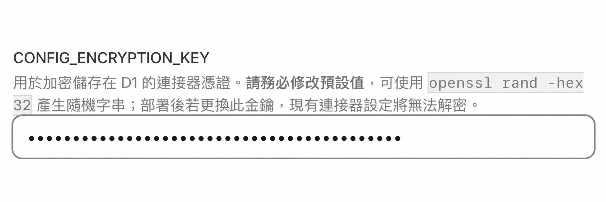
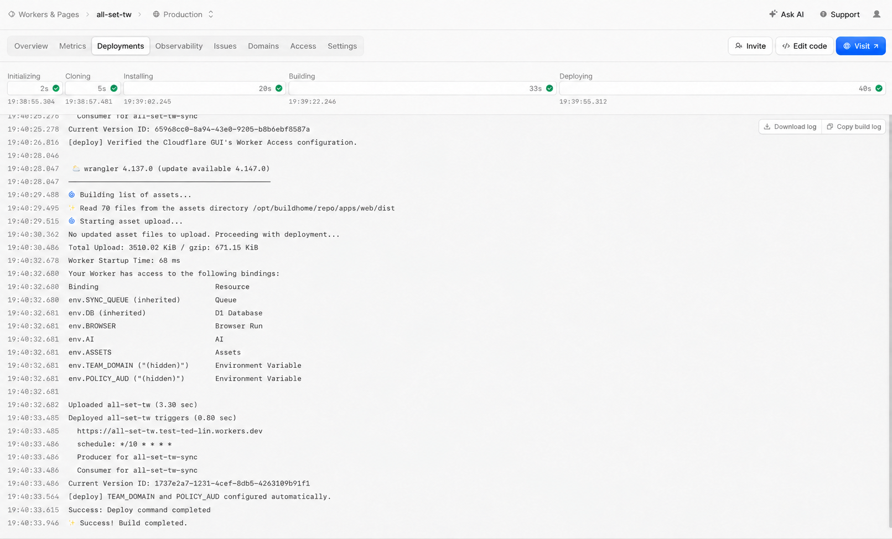
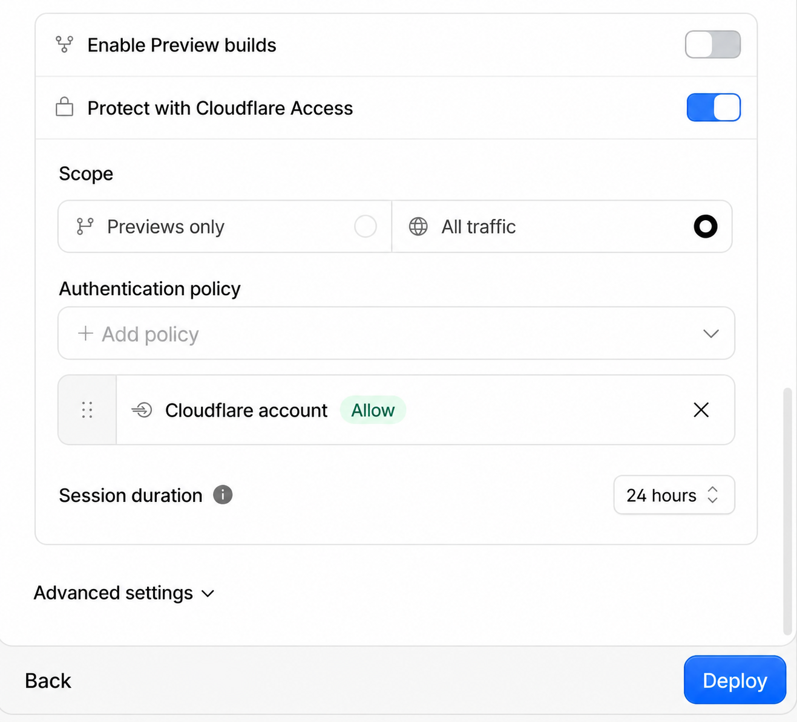
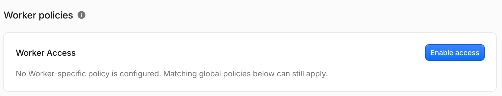
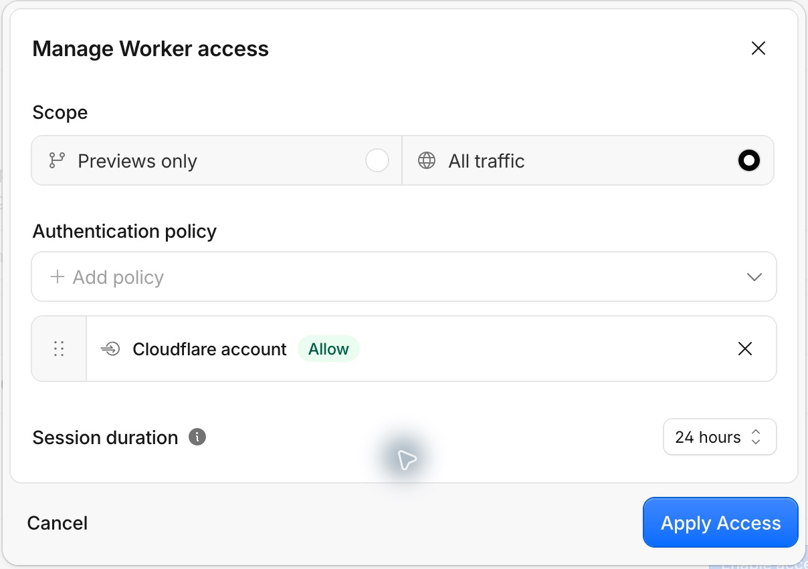
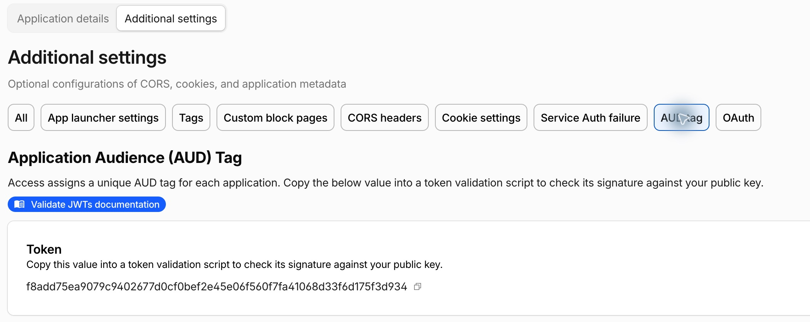
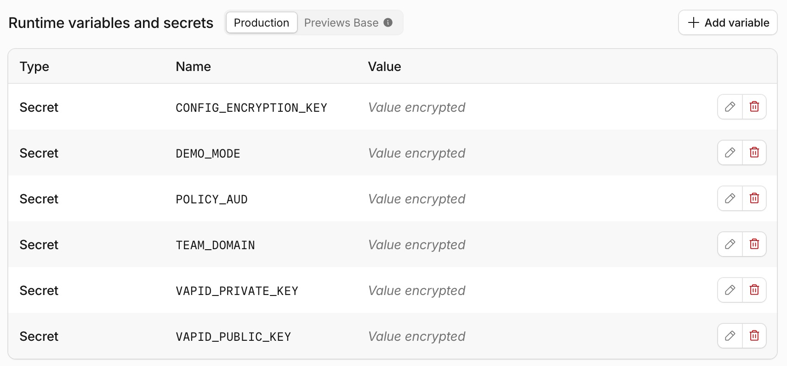

# 進階部署與更新

本文件補充 README 的部署流程，說明 Cloudflare Access、Secrets、自動更新、本機開發與既有 D1 部署。Cloudflare Dashboard 的名稱與位置可能調整；若畫面不同，請以官方文件為準。

## 部署前準備

- [Cloudflare 帳號](https://dash.cloudflare.com/sign-up)
- [GitHub 帳號](https://github.com/signup)
- 部署時填入的一組 `CONFIG_ENCRYPTION_KEY`

Workers、D1、Queues、Workers AI 與 Browser Run 均有免費額度，但並非無限。需要瀏覽器的連接器會共用 Browser Run 額度；Workers Free Plan 目前每日包含 10 分鐘，最新限制請參考 [Browser Run Pricing](https://developers.cloudflare.com/browser-run/pricing/)。

## 一鍵部署細節

### 1. 產生加密金鑰

```bash
openssl rand -hex 32
```

`CONFIG_ENCRYPTION_KEY` 用來加密 D1 中的連接器設定，一般私人部署仍然需要。使用一鍵部署時只需填入一次，Cloudflare 會保存並在後續部署中沿用；沒有另外記下不會影響現有 Worker。若日後要重建 Worker、搬移環境或沿用既有 D1，則必須使用相同金鑰，否則需要重新設定所有連接器。建議需要災難復原能力的使用者將它保存在密碼管理器，並且不要在既有部署中任意更換或刪除。

### 2. 執行 Deploy to Cloudflare

點擊 **Deploy to Cloudflare**，授權 Cloudflare 存取 GitHub，填入 `CONFIG_ENCRYPTION_KEY`，將 **Build command** 設為 `npm run build`、**Deploy command** 設為 `npm run deploy`。在同一頁關閉 **Enable Preview builds**，再開啟 **Protect with Cloudflare Access**，選擇 **All traffic** 與 **Cloudflare account**，確認後點擊 **Deploy**。



Cloudflare 會先建立 Worker，再於背景執行 build；頁面會自動跳轉至 **Builds**。GUI 會建立登入保護；部署 script 自動取得 Team domain 與 AUD，再部署包含 `TEAM_DOMAIN`、`POLICY_AUD` 的版本。在這兩個值完成前，API 的登入驗證不會成功。請等待該次 build 顯示成功，再點擊右上角的 **Visit** 開啟網站；若未出現 **Visit** 按鈕，請先重新整理 Worker 頁面。

<a href="../images/deploy-success.png"></a>

[Deploy to Cloudflare](https://developers.cloudflare.com/workers/platform/deploy-buttons/) 會從 repository 根目錄的 `.dev.vars.example` 讀取部署時需要填寫的 Secret，並從 `package.json` 取得欄位說明。本專案將正式部署範例與 `apps/worker/.dev.vars.example` 的本機開發設定分開，初始表單只保留加密金鑰；多 Application、Demo、本機開發與 VAPID 參數不需在首次部署填寫。

`.dev.vars.example` 定義 Worker Secret 欄位；Access 的開關、Scope、登入政策及期限需在 Cloudflare GUI 選擇。部署頁的登入期限最多可選 **7 days**，後續可在 Zero Trust [延長登入期限](#延長登入期限)。**Project name** 預設為 `all-set-tw`，由 `wrangler.toml` 的 `name` 定義；D1／Queue 的預填名稱也定義於同一檔案。請確認 **Deploy command** 為 `npm run deploy`；若 GUI 預填 `npx wrangler deploy`，需改為本專案的指令，才能執行完整設定。

**Enable Preview builds** 是 [Workers Builds 的分支建置設定](https://developers.cloudflare.com/workers/ci-cd/builds/build-branches/)，目前沒有官方支援的 Wrangler 設定或一鍵部署參數可指定其預設值，請在部署頁手動關閉。若已部署，可在 **Worker → Settings → Builds → Branch control** 關閉。`wrangler.toml` 的 `preview_urls = false` 只關閉 Version URLs，不會停止非正式分支的自動建置。

既有 Workers Builds 與部署 script 的 Secret 查詢會沿用已連接的 Worker 名稱，因此更新會保留原本的 Worker、Access 驗證值與 VAPID 金鑰。本機更新舊 Worker 時，請在私人 Wrangler 設定保留原本的 `name`，或於部署時指定 `--name`。

`TEAM_DOMAIN` 與 `POLICY_AUD` 可以存入私人 `.dev.vars` 作本機測試，但 `.dev.vars` 不會自動同步到正式 Worker；首次建立 Access Application 時，仍需先取得該帳戶的 Team domain 與新產生的 AUD。

Deploy to Cloudflare 會建立部署用 repository、D1 並設定 Workers Builds。本專案的 build 與 deploy script 會依 `wrangler.toml` 檢查 Queue，缺少時自動建立。同名的排程同步 Queue 若沒有 consumer，或 consumer 就是目前部署的 Worker，會直接沿用；若已由另一個 Worker 或 HTTP consumer 使用，部署 script 會自動選用 `<Worker 名稱>-sync`，名稱仍被占用時加上流水號。後續更新會沿用已分配的 Queue，原部署的 consumer 保持不變。producer 與 consumer 的名稱會在當次部署的暫存設定一併切換，不會修改 repository 原始設定。

部署 script 會保留既有 VAPID 金鑰，初次部署則自動產生。Cloudflare [每個 Queue 只能綁定一個 consumer Worker](https://developers.cloudflare.com/queues/get-started/#connect-the-consumer-worker-to-your-queue)，因此已有其他 consumer 的 Queue 無法同時提供新 Worker 的背景同步。

GUI 部署使用 Cloudflare Builds 原有的部署 token，不需另建 token 或授予 Access API 權限。

## Cloudflare Access

### 自動設定登入保護

Cloudflare GUI 的 **Deploy command：`npm run deploy`** 會執行 `scripts/deploy-with-vapid.mjs`，並透過 `scripts/cloudflare-access.mjs` 取得 Access 驗證值。使用者仍在 GUI 部署，無須在本機執行這些 script。

初次部署的流程如下：

1. 在部署頁開啟 **Protect with Cloudflare Access**，由 Cloudflare GUI 建立登入保護並保存選定的政策與期限。
2. 部署 Worker，保留填入的加密金鑰並產生或沿用 VAPID 金鑰。
3. 使用原有部署 token 查詢帳戶的 Workers subdomain，向正式 `workers.dev` 網址送出帶有 `cf-access-metadata-request: true` 的 HEAD 請求；不跟隨登入轉址，也不傳送 API token。
4. 驗證回傳的簽章 metadata：僅接受 Cloudflare Access Team domain 的 RS256 簽章、相符的 Worker hostname、有效的 Application AUD 與簽發時間。此方式沿用官方 [`cloudflared` 的 Access discovery](https://github.com/cloudflare/cloudflared/blob/master/token/token.go)，不需要查詢 Access API。
5. 從已驗證 metadata 的 `auth_domain` 與 `aud` 取得 `TEAM_DOMAIN`、`POLICY_AUD`，透過 `wrangler deploy --secrets-file` 部署為 Runtime Secrets。既有加密金鑰、VAPID 與其他 Secrets 會保留。

部署 script 不會改動 GUI 選定的登入方式、policy 及期限。**Previews only** 不會保護正式網址，無法完成正式網址的自動驗證值設定。已設定兩個 Access Secrets 的舊安裝會直接沿用，後續更新不需再次取得；這項判斷只檢查 Secret 名稱，不會讀取或驗證既有值。

若 build 顯示找不到 metadata，請在 **Worker → Access → Worker policies → Worker Access** 啟用 **All traffic**，再重試 build。若登入保護已啟用、最後寫入驗證值的部署失敗，重試會重新取得驗證值並保留既有 VAPID 金鑰。無法取得或驗證 metadata 時，不會將其內容寫成 Runtime Secrets，可改用下方的手動設定。

自動化只在 **Workers Builds（`WORKERS_CI=1`）** 執行。本機部署、`--dry-run` 與已知 `DEMO_MODE=true` 的部署會略過 Access 自動化；預覽 build 使用 Cloudflare 預設的 preview command，不會執行 `npm run deploy`。

需要自行維護 Access 驗證值時，可在 **Settings → Builds → Build variables and secrets** 設定 `ACCESS_AUTO_SETUP=false`，再使用下方的手動設定。若舊安裝的 Access Secrets 仍是暫填值，可在相同位置暫時設 `ACCESS_AUTO_SETUP=true` 並重試 build，重新取得正式網址的驗證值；成功後移除此變數。透過 Wrangler `vars` 或 `--secrets-file` 明確提供的手動 Access 驗證值應以手動流程維護。

### 部署成功但缺少 Access 驗證值

檢查 build log 的 **Executing user deploy command**。若為 `npx wrangler deploy`，只會部署 Worker，會跳過本專案的資料庫 migration、VAPID 金鑰與 Access 驗證值設定。前往 **Worker → Settings → Builds**，將 **Deploy command** 改為 `npm run deploy`，再重試 build。首次 Access 自動設定成功時，log 會出現 `[deploy] TEAM_DOMAIN and POLICY_AUD configured automatically.`。

### 啟用登入保護

首次部署依 README 在部署頁開啟 **Protect with Cloudflare Access** 即可。以下適用已部署 Worker 或部署頁未顯示該選項的情況；啟用後重試 build 即可自動取得驗證值。若停用自動化，建立登入保護後需繼續[設定 Worker 的 Access 驗證值](#設定-worker-的-access-驗證值)。



1. 前往 **Workers & Pages** 並選擇部署完成的 Worker。
2. 開啟 **Access** 頁籤，在 **Worker policies → Worker Access** 點擊 **Enable access**（部分介面稱 Protect this Worker behind Access）；已啟用時開啟設定對話框。
3. **Scope** 選擇 **All traffic**，保護正式與預覽部署。
4. **Authentication policy** 選擇 **Cloudflare account**，限定該 Cloudflare 帳戶成員；已有相同規則的 **Cloudflare account members** policy 也可使用。
5. 點擊 **Apply Access**。

Cloudflare 在 [2026-08-14 改版](https://developers.cloudflare.com/changelog/post/2026-08-14-workers-access/)後，可直接保護整個 Worker，涵蓋 `workers.dev`、自訂網域、routes 與預覽網址。**Previews only 不涵蓋正式網址**。若只要保護特定 hostname，可在 Zero Trust 建立對應的 Self-hosted Application；完整操作與規則優先順序請參考 [Cloudflare Access for Workers](https://developers.cloudflare.com/workers/configuration/cloudflare-access/)。





### 設定 Worker 的 Access 驗證值

1. 前往 **Cloudflare One／Zero Trust → Access controls → Applications**，找到保護目前 Worker 的 Application。
2. 開啟 **Configure → Additional settings → AUD tag**，複製 **Application Audience (AUD) Tag** 作為 `POLICY_AUD`。不要使用 Authentication policy 的 ID、Application ID 或只保護預覽網址的 Application AUD。
3. 在 **Overview → Account details → Team domain** 複製同一 organization 的網域，補上 `https://` 作為 `TEAM_DOMAIN`，例如 `https://yourteam.cloudflareaccess.com`；若已有 `https://`，直接使用。若提供 JWKs URL，移除 `/cdn-cgi/access/certs`；不要填入 Worker 網址、裸 Team Name 或其他路徑。
4. 回到 Worker 的 **Settings → Runtime variables and secrets → Production → Add variable**（部分介面稱 Variables and secrets），新增這兩個 **Secret** 並儲存／部署使設定生效。





AUD 的官方取得方式請參考 [Get your AUD tag](https://developers.cloudflare.com/cloudflare-one/access-controls/applications/http-apps/authorization-cookie/validating-json/#get-your-aud-tag)。一般私人部署只需要加密金鑰與這兩個 Access 值：

| 參數                    | 一般私人部署                   | 用途                                           |
| ----------------------- | ------------------------------ | ---------------------------------------------- |
| `CONFIG_ENCRYPTION_KEY` | 首次部署填入，後續沿用         | 加密連接器設定                                 |
| `TEAM_DOMAIN`           | 雲端部署自動設定，亦可手動設定 | JWT issuer 與簽章公鑰來源                      |
| `POLICY_AUD`            | 雲端部署自動設定，亦可手動設定 | 保護此 Worker 的 Application AUD               |
| `LOCAL_DEV_MODE`        | 不需設定，預設關閉             | 本機開發範例設為 `true`，僅略過 localhost 驗證 |
| `VAPID_*`               | 部署 script 自動產生並保留金鑰 | 本機測試推播時自行設定                         |

本專案仍由 Worker 驗證 Access JWT，因此需要 `TEAM_DOMAIN` 與 `POLICY_AUD`。Cloudflare 提供的 `ctx.access` 目前無法通過 Static Assets 的內部 router 傳入本專案的 Worker，詳見官方的 [`ctx.access` limitations](https://developers.cloudflare.com/workers/configuration/cloudflare-access/#ctxaccess-limitations)。

若使用舊版部署範例，請把暫填的 `TEAM_DOMAIN`／`POLICY_AUD` 換成實際值；只有單一 Application 時，可刪除暫填的 `POLICY_AUDS`。`DEMO_MODE`、`LOCAL_DEV_MODE` 在私人部署應為 `false` 或未設定。

### Access 驗證失敗

`Cloudflare Access JWT is invalid.` 是 Worker API 的登入驗證錯誤，發生於連接器執行之前；它不代表銀行或電子發票帳密有誤。這個訊息涵蓋簽章、公鑰取得、issuer、audience 與有效期限等失敗，不能僅憑此訊息判定是哪個值錯誤。

依序檢查：

1. Worker Access 是否已啟用，且 Scope 為 **All traffic**。
2. `POLICY_AUD` 是否為實際保護目前網址的 Application AUD。若同時有 hostname、Worker 與帳戶層級的 Access 規則，hostname 規則優先，其次是 Worker，再來才是帳戶規則。
3. `TEAM_DOMAIN` 是否屬於相同的 Zero Trust organization。`https://yourteam.cloudflareaccess.com` 是正確格式；簽章公鑰網址為其後加上 `/cdn-cgi/access/certs`。
4. 兩個值是否已存入 **Runtime variables and secrets** 並部署生效；Build variables 不會提供給 API runtime。
5. 若曾重建 Access Application 或改變保護範圍，重新複製 AUD，登出 Access 並重新登入以取得新 token。

程式會合併 `POLICY_AUD` 與 `POLICY_AUDS`，接受其中任一相符的 AUD。殘留 `POLICY_AUDS=temporary-placeholder` 不會覆蓋正確的 `POLICY_AUD`，但仍應清除不再使用的暫填設定。

### 使用 Cloudflare 帳號登入

Cloudflare Access 預設可能使用 Email OTP。如要限定 Cloudflare 帳號成員：

1. 前往 **Cloudflare One／Zero Trust → Integrations → Identity providers**。
2. 新增或開啟 **Cloudflare** Identity Provider，啟用 **Restrict to account members**。
3. 在 **Access controls → Applications** 找到保護此 Worker 的 Application，開啟 **Configure → Application details → Authentication → Identity**，將登入方式設為 Cloudflare。
4. 若只保留此登入方式，可啟用 **Apply instant authentication**。

### 延長登入期限

部署頁的 **Session duration** 最多可選 **7 days**。若要延長至一個月，部署完成後在 **Zero Trust → Access controls → Applications** 找到保護此 Worker 的 Application，再依下列方式調整：

若頁面顯示 **Finish your account setup**，先點擊 **Choose a plan**，完成 **Zero Trust Free** 方案設定；這是進入 Zero Trust 管理介面的步驟，無須列為一鍵部署的前置設定。

1. 點擊該 Application 的 **Configure**，開啟 **Application details**。
2. 點擊頁面上方與 **All、Destinations、Policies** 同一排的 **Details** 按鈕，或直接向下捲到頁面最下方。
3. 在 **Details** 區塊的 **Name** 欄位旁，將 **Session Duration** 設為 **1 month** 並儲存。

**Access controls → Access settings → Global session duration** 決定重新向 identity provider 驗證的頻率，可依需求調整。既有 Application token 在自己的期限內仍有效，並非一律採用 Global 與 Application 中較短的期限。詳見官方[Session management](https://developers.cloudflare.com/cloudflare-one/access-controls/access-settings/session-management/)。

## 自動更新

Deploy to Cloudflare 建立的新 repository 不會包含本專案的 `.github/workflows`，需要一次性安裝更新 workflow。

### 從 GitHub 網頁安裝

1. 在部署 repository 開啟 [`deploy/github/sync-upstream.yml`](../deploy/github/sync-upstream.yml)，點擊 **Raw** 並複製內容。
2. 回到 repository 首頁，選擇 **Add file → Create new file**。
3. 建立 `.github/workflows/sync-upstream.yml`，貼上內容並 commit 至 `main`。
4. 前往 **Settings → Actions → General → Workflow permissions**，允許 GitHub Actions 寫入 repository。

### 從本機安裝

```bash
mkdir -p .github/workflows
cp deploy/github/sync-upstream.yml .github/workflows/sync-upstream.yml
git add .github/workflows/sync-upstream.yml
git commit -m "啟用版本自動更新"
git push
```

完成後可從 **Actions → Sync Latest Version → Run workflow** 手動更新，也會在每天台灣時間 **04:15** 自動執行。

### 更新如何運作

workflow 會：

1. 取得 `TedLin1993/all-set-tw` 的最新 `main`。
2. 以前次同步版本為基準進行三方合併。
3. 保留部署 repository 自己的 `.github/workflows`。
4. 有新版本時推送至 `main`，由 Workers Builds 重新部署。

首次同步若沒有共同 Git history，更新器只會在部署內容可對應到上游版本、且 workflows 以外沒有自行修改時接軌。同步前會建立 `backup-before-first-upstream-sync` branch；同名 branch 已存在時不會覆寫。

若匯入時已客製 `package.json` 名稱或 `wrangler.toml` 的資源名稱，首次版本的完整比對可能無法通過。需先備份部署 branch，逐一核對初始 tree 與候選上游 commit 的差異；只有確認差異皆為預期的部署設定後，才可建立含 `Taiwan-Fin-Hub-Upstream: <完整上游 SHA>` 的修復 commit 作為接軌基準。不得使用未核對的 SHA 或直接標記最新版本，否則可能跳過必要更新。

若部署的 Worker 名稱與上游基準不同，同步會保留 `wrangler.toml` 的頂層 `name`，讓上游更名不影響既有部署。其他設定仍參與三方合併；發生衝突時停止推送。

後續同步會在 commit message 記錄上游基準，不使用 force push。若本地修改與上游衝突，更新器會在推送前停止，保留目前內容供手動處理。

### 更新故障排查

- **Workflow 沒有執行**：確認檔案位於 `.github/workflows/sync-upstream.yml`，並檢查 Actions 是否啟用。
- **無法推送更新**：確認 Workflow permissions 允許寫入 repository。
- **合併衝突**：從該次 Actions log 查看衝突檔案，手動合併後再重新執行。
- **`fatal: refusing to merge unrelated histories`**：部署 repository 仍在使用舊版 workflow，請重新複製最新的 [`deploy/github/sync-upstream.yml`](../deploy/github/sync-upstream.yml)。
- **Queue 權限錯誤**：替 Workers Builds API token 增加帳戶層級的 Queues Read 與 Queues Edit。

更新流程會保留部署 repository 目前安裝的 workflow，因此上游若修正更新流程，仍需手動替換 workflow 檔案。

## 組建版本資訊

「關於」頁面顯示 `TedLin1993/all-set-tw` 的上游 Commit、追蹤分支 `main` 與本次部署的 UTC 組建時間，並可一次複製診斷資訊。
`scripts/build-info.mjs` 在 Vite 組建時辨識採用的上游版本，再由 `apps/web/vite.config.ts` 寫入前端產物。

- 官方 repository 的 checkout 使用 `HEAD` 作為上游 Commit。
- 獨立部署只採用目前 `HEAD` 中更新器寫入的 `Taiwan-Fin-Hub-Upstream` 紀錄。
- 沒有紀錄的 fork／首次一鍵部署會在暫存 Git repository 取得官方 `main`；`HEAD` 本身位於上游歷史時使用該 Commit，沒有 parent 的首次匯入則以目前原始碼快照比對版本，忽略部署流程未複製的 `.github/workflows`。
- 使用者在同步後自行新增 commit 時，Commit 顯示「未知」；完整與淺層 checkout 採用相同規則，不沿用先前的同步紀錄、共同祖先或初始快照。

版本比對只讀取上游，不變更部署 repository。首次辨識需要連線 GitHub；無法辨識時 Commit 顯示「未知」。
本機 Vite dev server 的時間代表啟動時刻，正式組建則代表該次 Vite build 的時間；重新部署既有產物不會改變時間。

在 GitHub 建立「問題回報」Issue 前，請先從桌面「設定 → 關於」或手機「更多 → 關於」點選「複製診斷資訊」，
將完整內容貼到表單的「診斷資訊」欄位。若版本沒有「關於」頁或無法取得，請填「無法取得」並說明原因。

## 本機開發

建立私人設定檔並填入開發用 D1 Database ID 與加密金鑰：

```bash
cp apps/worker/wrangler.local.toml.example apps/worker/wrangler.local.toml
cp apps/worker/.dev.vars.example apps/worker/.dev.vars
npm install
npx wrangler login
npm run dev
```

範例設定中的 D1 與 Workers AI 使用 remote binding，會連到 Cloudflare 資源。請使用獨立的開發 D1，不要直接操作正式資料。

SQL migrations 位於 `apps/worker/migrations/`。根目錄 `wrangler.toml` 的 `migrations_dir` 使用 `apps/worker/migrations`；`apps/worker/wrangler.local.toml` 使用相對於該設定檔的 `migrations`。若已建立私人 Wrangler 設定，請同步更新其 migration 路徑；既有 migration 檔名與內容維持原樣。

常用資料庫遷移指令：

```bash
npm run db:migrate:local -w @taiwan-fin-hub/worker
npm run db:migrate:remote
```

中信行動銀行的 TLS endpoint 無法由 local workerd 直接連線，因此 `npm run dev` 會自動啟動只監聽 `127.0.0.1`、限制目的端點並使用單次隨機 token 的 Node relay；正式 Worker 不使用此 relay。

## Demo 模式

設定 `DEMO_MODE=true` 會略過 Cloudflare Access 登入、只允許唯讀 API，並停止背景排程同步，適合用來公開展示介面。

Demo 模式下任何人都能讀取該 Worker 綁定的 D1 資料，因此必須部署為獨立的 Worker，並綁定只含展示資料的 staging／demo D1；不要在儲存真實帳戶資料或連接器設定的部署啟用此模式。

## 部署至既有 D1

若要從本機部署至既有 D1，可在 repository 根目錄複製 `wrangler.toml` 為被忽略的 `wrangler.private.toml`，填入正確的 `database_id`，再執行：

```bash
XDG_CONFIG_HOME=.wrangler-config npx wrangler d1 migrations apply DB \
  --remote --config wrangler.private.toml
XDG_CONFIG_HOME=.wrangler-config node scripts/deploy-with-vapid.mjs \
  --config wrangler.private.toml
```

執行前請再次確認 `database_id`、Worker 名稱與所有 bindings 都指向預期環境。資料庫 migration 會修改遠端 schema，不要使用未確認的正式資料庫進行測試。

若既有 D1 已儲存連接器設定，部署時也必須提供原本相同的 `CONFIG_ENCRYPTION_KEY`；新的隨機金鑰無法解密既有資料。
